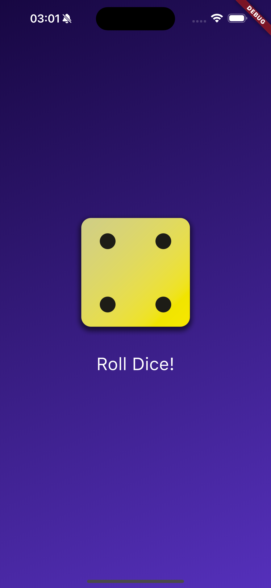

# Roll a dice app

In this project we follow the [Udemy Flutter & Dart Complete Guide](https://www.udemy.com/course/learn-flutter-dart-to-build-ios-android-apps/?couponCode=24T4MT90924A), to create a basic app where we roll a dice. The main goal of this project was to get a basic understanding of flutter and dart, and how to work with it.

## How to run the project

You will need an enviroment to work with flutter, i advice to follow their [tutorial](https://docs.flutter.dev/get-started/editor). Afther that it should be as easy to clone the project, setup the simulator and run the project.

